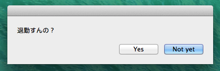
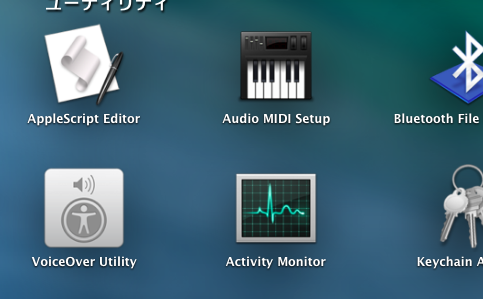
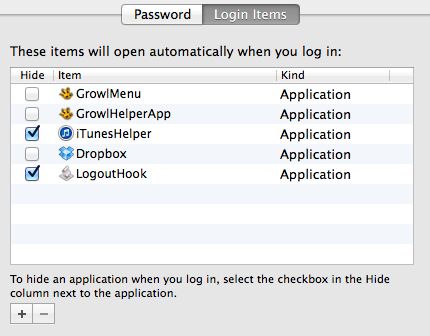

# LogoutHook.app

LogoutHook open dialog when you do logout.

LoginHook, LogoutHook and StartupItems of Mac OSX is deprecated and it is prefered that we use launchd instead of the deprecated.

## Screen



## Installation

This app is just applescript application.
So, you only get LogoutHook.app like the following.

```sh
$ cd ~
$ git clone github.com:terut/logouthook.git
```

Then open applescript editor, and edit LogoutHook.app. you can change to your favorite script.



```applescript
on quit
  display dialog "退勤すんの？" buttons {"Yes", "Not yet"} default button "Not yet"
  
  if button returned of result is "Yes" then
    --change next row.
    do shell script "/usr/bin/say goodbye"
    continue quit
  else if button returned of result is "Not yet" then
    continue quit
  end if
end quit
```

Also open system preference, and set this app to startupitems with user and group settings.


